# Running the System in a Dev Container

This document describes how to launch and configure the development environment using a Dev Container, provides a general overview of the ROS2 architecture, and includes a detailed installation guide.

---

## 1. Project Overview

This project uses [Dev Containers](https://code.visualstudio.com/docs/remote/containers) to create an isolated and fully configured development environment. All dependencies are managed within the container to ensure consistency across systems and developers.

---

## 2. Prerequisites

Before starting, make sure your system has:
- **Docker**
- **Visual Studio Code** (optional, but recommended)
- **Remote - Containers** extension for VS Code

---

## 3. General ROS2 Architecture

### 3.1 Main Components

ROS2 is built around a **node/topic** architecture coordinated via **DDS** (Data Distribution Service):

- **Nodes**: independent processes executing specific tasks (e.g., sensors, planning, control)
- **Topics**: publish/subscribe communication channels for message exchange
- **Services**: synchronous request/response calls between nodes
- **Actions**: asynchronous tasks with feedback and cancellation support

### 3.2 High-Level Diagram

```mermaid
%%{init: {
  "theme": "default",
  "flowchart":{"layout":"elk"}
}}%%

flowchart LR
    %% Camera nodes
    subgraph Sensors
        Camera1Node["Camera1Node"] 
        Camera2Node["Camera2Node"]
    end 
    

    %% Raw image topics
    Camera1Node -->|publishes <br> sensor_msgs/Image| qos1[/"/camera1/image_raw <br>(best_effort, depth=1)"/]
    Camera2Node -->|publishes <br> sensor_msgs/Image| qos2[/"/camera2/image_raw <br>(best_effort, depth=1)"/]


    %% Frame sync node & topic
    subgraph Preprocessing
        StereoSyncNode[StereoSyncNode]
    end
    StereoSyncNode -->|publishes <br> msg/StereoImages| stereo[/"/stereo_images <br>(best_effort, depth=1)"/]

    %% Processing nodes
    subgraph Processing
      MonoVisionNode[MonoVisionNode]
      StereoVisionNode[StereoVisionNode]
      VisualOdometryNode[VisualOdometryNode]
    end

    %% Subscriptions
    qos1 --> StereoSyncNode
    qos2 --> StereoSyncNode
    stereo --> MonoVisionNode
    stereo --> StereoVisionNode
    stereo --> VisualOdometryNode

    %% Output topics
    MonoVisionNode -->|publishes <br> custom_msgs/MonoOutput| monoOut[/"/mono_vision/output <br>(reliable, depth=10)"/]
    StereoVisionNode -->|publishes <br> custom_msgs/StereoOutput| stereoOut[/"/stereo_vision/output <br>(reliable, depth=10)"/]
    VisualOdometryNode -->|publishes <br> custom_msgs/Odometry| odomOut[/"/visual_odometry/output <br>(reliable, depth=10)"/]

    %% Packaging & modem
    subgraph Communication
      DataAggregator[DataAggregatorNode]
      ModemDriver[ModemDriverNode]
    end

    monoOut --> DataAggregator
    stereoOut --> DataAggregator
    odomOut --> DataAggregator

    DataAggregator -->|"publishes <br> std_msgs/String <br> (JSON)"| dataTopic[/"/data_to_modem <br>(reliable, depth=10)"/]
    dataTopic --> ModemDriver

    %% Definizione della classe
    classDef nodeClass fill:#ffcccc,stroke:#ff0000,stroke-width:2px;
    classDef topicClass fill:#fffe00,stroke:#ff000,stroke-width:2px;

    %% Assegnazione della classe ai nodi
    class Camera1Node,Camera2Node,MonoVisionNode,StereoVisionNode,VisualOdometryNode,DataAggregator,ModemDriver,StereoSyncNode nodeClass;
    class stereo,qos1,qos2,monoOut,stereoOut,odomOut,dataTopic topicClass;


```


The system is built with 4 main nodes blocks: 
- **Sensors**: Nodes which will obtain data
- **Preprocessing**: Nodes which will pre-process data, before sending to the **processing** block
- **Processing**: Nodes which will process data
- **Communication**: Nodes which will compress and send data thourgh an acoustic modem

**Sensors**,  **Preprocessing** and **Communication** will run on a **RaspberryPi 5**. <br>
**Processing**, given it's strong computational cost, will run on an **Nvidia Jetson Nano**.

### 3.3 Design Details

We designed 4 macro-groups in order to increare modularity. 

#### Sensors
- Nodes which publish frames obtained by cameras
   - Camera1Node<br>
   Gets frames from camera 1
   - Camera2Node<br>
   Gets frames from camera 2
- Run on ***Raspberry Pi 5***

#### Preprocessing
- Nodes which prepare the frames before sending them to the processing block
   - **StereoSyncNode**<br>
   By checking the timestamp, it syncronizes two frames and publishes them as a syncronized frame pair 
- Run on ***Raspberry Pi 5***


#### Processing
- Nodes which uses computer vision to retrieve data from images
   - **MonoVisionNode**<br>
   Classification with mono-vision (only one camera frame is used)
   - **StereoVisionNode**<br>
   Classification with stereo-vision
   - **VisualOdometryNode**<br>
   ?
- Run on ***Nvidia Jetson Nano***

#### Communication
- Nodes which compress and send data thorugh an acoustic modem
   - **DataAggregationNode**<br>
   Gets data from the processing block it aggregates them in standardized json files
   - **ModemDriverNode**<br>
   Compresses data and sends them through the acoustic modem
- Run on ***Raspberry Pi 5***


---

## 4. How to Run the Container
> Note: The first time the build may take up to 30min to build
### 4.1 With VSCode


1. *Open the workspace rovOS*
2. *Enter CMD+SHIFT+P (Mac) or CTRL+SHIFT+P (Windows/Linux)*
3. *Search for* `>Dev Containers: Rebuild and Reopen in Container`

>Note: `Remote - Containers` must be installed

Alternatively you can
1. *Open the workspace rovOS*
2. *Open* `compose.yaml` *file*
3. *Click on* `Run all services` *button on top of the code*

### 4.2 Without VSCode

1. `cd` to the `rovOS` folder
2. run `docker compose up`

---

## 5. Accessing the GUI

Once the container is running, open your browser and navigate to:

[http://localhost:6080/](http://localhost:6080/)

This interface (based on noVNC) allows you to interact with the graphical environment inside the container.

---

## 6. Known Issues on Apple M1 (ARM)

On Apple M1 machines, you may encounter:

- **IntelliSense not resolving system headers** in C/C++
- False-positive errors in `.cpp` and `.h` files

### 6.1 Workaround

Add the following to `src/ros2_wp/.vscode/c_cpp_properties.json`:
```json
"forcedInclude": [
    "${workspaceFolder}/.vscode/eigen_fix.h"
]
```

This ensures that IntelliSense preloads the necessary definitions for proper parsing.

---

## 7. Additional Resources

- [Official Dev Containers Guide](https://code.visualstudio.com/docs/remote/containers)
- [ROS2 Documentation](https://docs.ros.org/)
- [ros2_wp Setup README](https://github.com/Jacopix/rovOS/blob/main/src/ros2_wp/docs/README.md)

If you have any questions or run into issues, please contact the development team.

